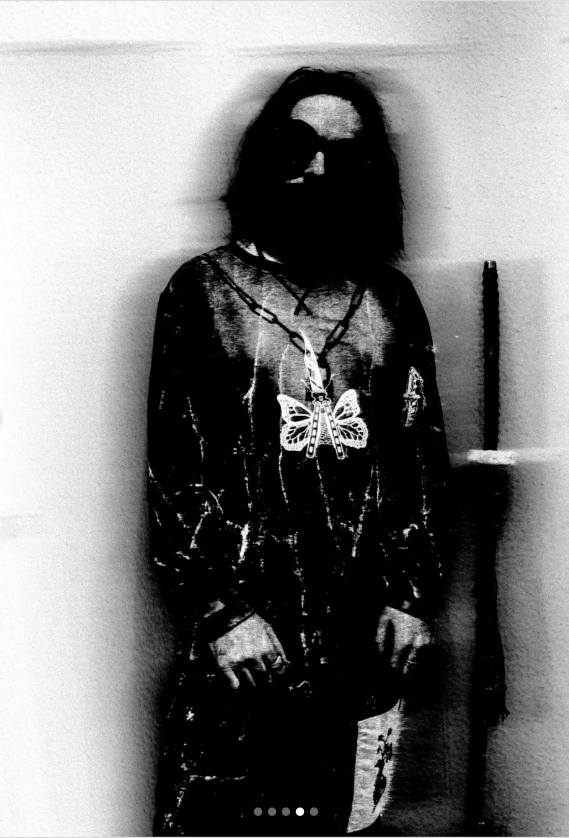

# covercrib

CoverCrib aims to provide the most similar music covers images among your spotify liked music regarding to an input image. 
Functionality:
- If a precomputed features file exists (`data/liked_tracks_cover_features.h5`), it loads the features and album names.
- If the features file does not exist, it connects to Spotify, extracts liked songs, and computes with mobileNet v2 features  for them.
- Normalizes the dataset features.
- Extracts and normalizes features for the external image provided via `img_path`.
- Computes cosine similarity between the external image features and the dataset features.
- Outputs a sorted DataFrame of album names and their similarity scores.

tf_lite can be used for a future integration to mobile app with kivy.
Personnal keys to connect to my spotify are not given here. For now it is necessary to create your owns with spotify developpers and add it to an .env file like:
SPOTIFY_CLIENT_SECRET=""
SPOTIFY_CLIENT_ID=""
SPOTIFY_REDIRECT_URI="http://localhost:8888/callback"

Thus my liked songs are not given neither, because yours are automatically extracted when you connect to your spotify. 

TODO: 
To be able to extract other playlist than just liked songs
Update .h5 features files if asked only with songs not already featurized
Add a function to display the input image and the top 5 similar albums
Switch to Kivy for a mobile GUI usage

Exemple  
Input:  

  

Output:  
Top 3 similar album covers
album,similarity
Gotham Ville,0.64898646
Ma vision,0.64482456
Dolo,0.644059

 

  

